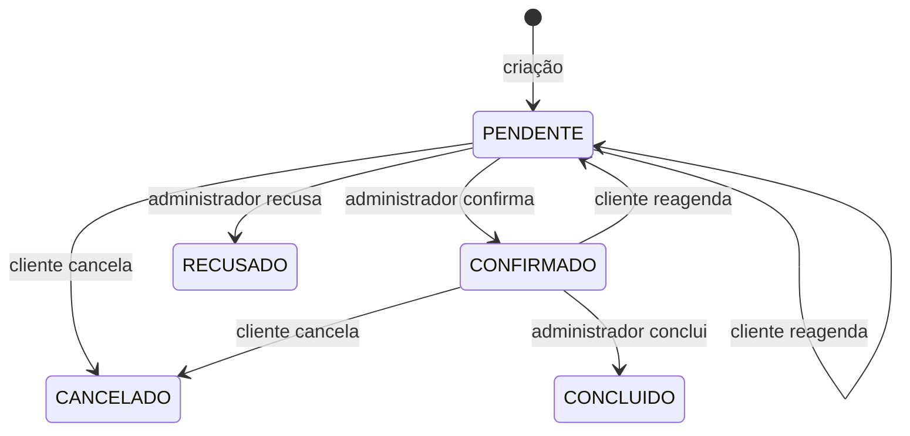

# Barbearia Backend

API REST para gerenciamento de usuários, serviços e agendamentos de uma barbearia com um único barbeiro. O projeto oferece autenticação por JWT, autorização por perfil, cálculo de disponibilidade em intervalos flexíveis e operações administrativas para conduzir o ciclo de atendimento.

> Este documento descreve o comportamento disponível no código atual. A URL usada nos exemplos locais é `http://localhost:8080`.

## Sumário

- [Tecnologias](#tecnologias)
- [Regras principais](#regras-principais)
- [Como executar o projeto](#como-executar-o-projeto)
- [Autenticação e autorização](#autenticação-e-autorização)
- [Formatos usados pela API](#formatos-usados-pela-api)
- [Modelos de resposta](#modelos-de-resposta)
- [Resumo dos endpoints](#resumo-dos-endpoints)
- [Autenticação](#autenticação)
- [Usuários](#usuários)
- [Serviços](#serviços)
- [Agendamentos](#agendamentos)
- [Operações administrativas](#operações-administrativas)
- [Respostas de erro](#respostas-de-erro)
- [Integração com o frontend](#integração-com-o-frontend)

## Tecnologias

- Java 21
- Spring Boot 4.1
- Spring MVC
- Spring Data JPA e Hibernate
- Spring Security
- OAuth2 Resource Server com JWT HS256
- SQL Server
- Bean Validation
- MapStruct
- Lombok
- Maven Wrapper

## Regras principais

### Funcionamento da agenda

- Existe apenas um barbeiro. Portanto, os agendamentos compartilham a mesma agenda.
- Segunda a sexta-feira: `16:00` às `21:00`.
- Sábado e domingo: `10:00` às `22:00`.
- Fuso horário: `America/Sao_Paulo`.
- Antecedência mínima: 1 hora.
- Antecedência máxima: 30 dias.
- O intervalo interno da barbearia existe na configuração, mas está desativado atualmente.
- Os horários não seguem uma grade fixa de 30 minutos. O cliente pode escolher qualquer minuto disponível.
- Segundos e nanos devem ser zero. Use, por exemplo, `2026-08-22T16:30:00`.
- O serviço precisa começar e terminar integralmente dentro do horário de funcionamento.
- Apenas agendamentos `PENDENTE` e `CONFIRMADO` ocupam a agenda.
- Agendamentos `CONCLUIDO`, `CANCELADO` ou `RECUSADO` não bloqueiam novos horários.

### Status dos agendamentos



- Um reagendamento sempre deixa o pedido como `PENDENTE`, mesmo que ele estivesse confirmado.
- Apenas o dono do agendamento pode cancelá-lo ou reagendá-lo.
- Um agendamento só pode ser cancelado ou reagendado antes do seu horário inicial.
- Um agendamento só pode ser concluído depois do horário inicial somado à duração do serviço.

## Como executar o projeto

### Pré-requisitos

- JDK 21
- SQL Server em execução
- Git
- As tabelas `TBL_USUARIO`, `TBL_SERVICO` e `TBL_AGENDAMENTO` já criadas

O projeto usa:

```properties
spring.jpa.hibernate.ddl-auto=validate
```

Por isso, o Hibernate valida as tabelas, mas não cria nem modifica o banco automaticamente.

### 1. Clonar o repositório

```bash
git clone https://github.com/LucasMoraes-Git/barbearia-backend.git
cd barbearia-backend
```

### 2. Criar o arquivo `.env`

No Windows PowerShell:

```powershell
Copy-Item .env.example .env
```

No Linux ou macOS:

```bash
cp .env.example .env
```

Preencha o arquivo sem versioná-lo:

```properties
DB_URL=jdbc:sqlserver://localhost:1433;databaseName=BARBEARIA_DB;encrypt=true;trustServerCertificate=true
DB_USERNAME=seu_usuario
DB_PASSWORD=sua_senha
JWT_SECRET=sua_chave_base64
CORS_ALLOWED_ORIGINS=http://localhost:5173
```

Para mais de uma origem de frontend, separe os endereços por vírgula e não coloque `/` no final:

```properties
CORS_ALLOWED_ORIGINS=http://localhost:5173,https://barbearia.exemplo.com.br
```

Nunca envie o `.env` ao GitHub. Apenas o `.env.example`, sem credenciais reais, deve ser versionado.

### 3. Gerar a chave do JWT

A chave deve estar em Base64 e representar pelo menos 256 bits. No PowerShell:

```powershell
$bytes = New-Object byte[] 32
$rng = [System.Security.Cryptography.RandomNumberGenerator]::Create()
$rng.GetBytes($bytes)
[Convert]::ToBase64String($bytes)
$rng.Dispose()
```

Copie o resultado para `JWT_SECRET`.

No Linux ou macOS também é possível usar:

```bash
openssl rand -base64 32
```

### 4. Executar

No Windows:

```powershell
.\mvnw.cmd spring-boot:run
```

No Linux ou macOS:

```bash
./mvnw spring-boot:run
```

A API estará disponível em:

```text
http://localhost:8080
```

### 5. Executar os testes

Windows:

```powershell
.\mvnw.cmd test
```

Linux ou macOS:

```bash
./mvnw test
```

### Criar o primeiro administrador

O cadastro público sempre cria um usuário com o perfil `CLIENTE`. Para preparar o primeiro administrador em um ambiente controlado:

1. Cadastre o usuário normalmente por `POST /usuarios/cadastro`.
2. Altere o perfil diretamente no banco:

```sql
UPDATE TBL_USUARIO
SET TX_USUARIO_PERFIL = 'ADMIN'
WHERE TX_EMAIL = 'admin@exemplo.com';
```

3. Faça login novamente para gerar um JWT contendo `perfil: ADMIN`.

Não reutilize um token emitido antes da mudança de perfil, pois as permissões estão gravadas dentro do próprio JWT.

## Autenticação e autorização

A API é stateless: não existe sessão no servidor. Após o login, envie o token em toda rota protegida:

```http
Authorization: Bearer SEU_TOKEN
```

O token atual:

- usa HS256;
- contém `usuarioId` e `perfil`;
- expira em 3.600 segundos, equivalentes a 1 hora;
- não possui refresh token;
- não possui endpoint de logout. Para sair, o frontend deve descartar o token.

### Níveis de acesso

| Acesso | Significado |
|---|---|
| Público | Não exige token |
| Autenticado | Exige JWT válido; aceita `CLIENTE` ou `ADMIN` |
| ADMIN | Exige JWT válido com `perfil: ADMIN` |

Respostas comuns de segurança:

- `401 Unauthorized`: token ausente, inválido ou expirado em uma rota autenticada.
- `403 Forbidden`: token válido, mas sem o perfil exigido.

Os erros `401` e `403` produzidos diretamente pelo Spring Security podem ter formato diferente do `ProblemDetail` usado pelas regras de negócio.

No Postman, abra a aba **Authorization**, selecione **Bearer Token** e cole apenas o valor de `token` devolvido pelo login. O Postman acrescentará o prefixo `Bearer` ao cabeçalho automaticamente.

## Formatos usados pela API

| Tipo | Formato | Exemplo |
|---|---|---|
| Data | `yyyy-MM-dd` | `2026-08-22` |
| Data e hora | `yyyy-MM-dd'T'HH:mm:ss` | `2026-08-22T16:30:00` |
| Telefone | somente 10 ou 11 dígitos | `11987654321` |
| Preço | número JSON ou decimal com ponto na URL | `45.50` |
| Perfil | letras maiúsculas | `ADMIN`, `CLIENTE` |
| Status | letras maiúsculas | `PENDENTE`, `CONFIRMADO`, `CONCLUIDO`, `CANCELADO`, `RECUSADO` |

Datas de agendamento são `LocalDateTime`: não envie `Z` nem converta o valor para UTC. O horário recebido representa diretamente o horário local da barbearia.

## Modelos de resposta

### Usuário

```json
{
  "id": 1,
  "nome": "LUCAS MORAES",
  "email": "lucas@exemplo.com",
  "telefone": "11987654321",
  "usuarioPerfil": "CLIENTE",
  "ativo": true
}
```

A senha nunca é devolvida pela API.

### Serviço

```json
{
  "id": 1,
  "nome": "Corte de cabelo",
  "descricao": "Corte masculino",
  "preco": 45.0,
  "duracaoMinutos": 40,
  "ativo": true
}
```

### Agendamento

```json
{
  "id": 10,
  "usuarioId": 1,
  "usuarioNome": "LUCAS MORAES",
  "usuarioEmail": "lucas@exemplo.com",
  "usuarioTelefone": "11987654321",
  "servicoId": 1,
  "servicoNome": "Corte de cabelo",
  "dataCriado": "2026-08-18T19:15:00",
  "dataServico": "2026-08-22T16:30:00",
  "status": "PENDENTE",
  "observacao": "Corte baixo nas laterais"
}
```

### Disponibilidade

```json
{
  "servicoId": 1,
  "servicoNome": "Corte de cabelo",
  "duracaoMinutos": 40,
  "data": "2026-08-22",
  "intervalos": [
    {
      "primeiroInicioPossivel": "2026-08-22T10:00:00",
      "ultimoInicioPossivel": "2026-08-22T11:20:00",
      "fimDeIntervaloLivre": "2026-08-22T12:00:00"
    }
  ]
}
```

O exemplo acima não representa apenas duas opções. Para um serviço de 40 minutos, qualquer horário entre `10:00` e `11:20`, com precisão de minutos, cabe no intervalo que termina às `12:00`.

## Resumo dos endpoints

### Públicos

| Método | Endpoint | Função |
|---|---|---|
| `POST` | `/auth/login` | Autenticar e obter JWT |
| `POST` | `/usuarios/cadastro` | Cadastrar cliente |
| `GET` | `/servicos/pelo-id/{id}` | Buscar serviço ativo por ID |
| `GET` | `/servicos/preco-abaixo-de/{preco}` | Buscar serviços ativos até determinado preço |
| `GET` | `/servicos/preco-entre/{precoMenor}/{precoMaior}` | Buscar serviços ativos em uma faixa de preço |
| `GET` | `/servicos/ativo` | Listar serviços ativos |
| `GET` | `/servicos/com-nome/{nome}` | Pesquisar serviços ativos pelo nome |

### Autenticados

| Método | Endpoint | Função |
|---|---|---|
| `GET` | `/usuarios/me` | Consultar o próprio perfil |
| `PATCH` | `/usuarios/me/novo-nome` | Alterar o próprio nome |
| `PATCH` | `/usuarios/me/novo-telefone` | Alterar o próprio telefone |
| `PATCH` | `/usuarios/me/nova-senha` | Alterar a própria senha |
| `POST` | `/agendamentos` | Criar agendamento |
| `GET` | `/agendamentos/me` | Listar os próprios agendamentos |
| `GET` | `/agendamentos/disponibilidade` | Consultar intervalos disponíveis |
| `PATCH` | `/agendamentos/{id}/cancelar` | Cancelar o próprio agendamento |
| `PATCH` | `/agendamentos/{id}/reagendar` | Reagendar o próprio agendamento |

### Administrativos

| Método | Endpoint | Função |
|---|---|---|
| `PATCH` | `/admin/usuarios/{email}/ativar` | Ativar usuário |
| `PATCH` | `/admin/usuarios/{email}/desativar` | Desativar usuário |
| `GET` | `/admin/servicos/inativo` | Listar serviços inativos |
| `GET` | `/admin/servicos/pelo-id/{id}` | Buscar qualquer serviço por ID |
| `GET` | `/admin/servicos/com-nome/{nome}` | Pesquisar serviços ativos e inativos |
| `POST` | `/admin/servicos/cadastro` | Cadastrar serviço |
| `PUT` | `/admin/servicos/atualizar/{id}` | Substituir os dados do serviço |
| `PATCH` | `/admin/servicos/{id}/ativar` | Ativar serviço |
| `PATCH` | `/admin/servicos/{id}/desativar` | Desativar serviço |
| `GET` | `/admin/agendamentos?data=...&status=...` | Listar agenda do dia |
| `GET` | `/admin/agendamentos/status/{status}` | Listar agendamentos de um status em todas as datas |
| `PATCH` | `/admin/agendamentos/{id}/recusar` | Recusar agendamento pendente |
| `PATCH` | `/admin/agendamentos/{id}/confirmar` | Confirmar agendamento pendente |
| `PATCH` | `/admin/agendamentos/{id}/concluir` | Concluir agendamento confirmado |

## Autenticação

### `POST /auth/login`

**Acesso:** público.

Autentica por e-mail e senha. Usuários inativos também recebem a resposta genérica de credenciais inválidas.

Requisição:

```json
{
  "email": "lucas@exemplo.com",
  "senha": "senhaSegura123"
}
```

Sucesso — `200 OK`:

```json
{
  "token": "eyJhbGciOiJIUzI1NiJ9...",
  "tipo": "Bearer",
  "expiraEmSegundos": 3600
}
```

Erros possíveis:

| HTTP | Código | Quando ocorre |
|---|---|---|
| `400` | `DADOS_INVALIDOS` | E-mail vazio, formato inválido ou senha vazia |
| `400` | `CORPO_REQUISICAO_INVALIDO` | JSON ausente ou malformado |
| `401` | `CREDENCIAIS_INVALIDAS` | E-mail inexistente, senha incorreta ou conta inativa |

## Usuários

### `POST /usuarios/cadastro`

**Acesso:** público.

Cria uma conta ativa com perfil `CLIENTE`. O nome é salvo em letras maiúsculas, o e-mail em letras minúsculas e a senha é armazenada com BCrypt.

Requisição:

```json
{
  "nome": "Lucas Moraes",
  "email": "lucas@exemplo.com",
  "telefone": "11987654321",
  "senha": "senhaSegura123"
}
```

Validações:

- `nome`: obrigatório, máximo de 100 caracteres;
- `email`: obrigatório, válido, máximo de 100 caracteres;
- `telefone`: obrigatório, somente 10 ou 11 dígitos;
- `senha`: obrigatória, de 8 a 72 caracteres.

Sucesso — `201 Created`: retorna um [Usuário](#usuário).

Erros possíveis:

| HTTP | Código | Quando ocorre |
|---|---|---|
| `400` | `DADOS_INVALIDOS` | Algum campo viola as validações |
| `400` | `CORPO_REQUISICAO_INVALIDO` | JSON ausente ou malformado |
| `409` | `RECURSO_DUPLICADO` | E-mail ou telefone já cadastrado |

### `GET /usuarios/me`

**Acesso:** autenticado.

Obtém o perfil correspondente ao `usuarioId` do JWT. Não recebe ID pela URL.

Sucesso — `200 OK`: retorna um [Usuário](#usuário).

Erros: `401` para token ausente/inválido/expirado e `404 RECURSO_NAO_ENCONTRADO` quando o usuário não existe ou está inativo.

### `PATCH /usuarios/me/novo-nome`

**Acesso:** autenticado.

Requisição:

```json
{
  "nome": "Lucas Moraes da Silva"
}
```

Sucesso — `204 No Content`.

Erros: `400 DADOS_INVALIDOS`, `400 CORPO_REQUISICAO_INVALIDO`, `400 ALTERACAO_INVALIDA` quando o nome é igual ao atual, `404 RECURSO_NAO_ENCONTRADO` para usuário inexistente/inativo e `401` para falha de autenticação.

### `PATCH /usuarios/me/novo-telefone`

**Acesso:** autenticado.

Requisição:

```json
{
  "telefone": "11999998888"
}
```

Sucesso — `204 No Content`.

Erros: `400 DADOS_INVALIDOS`, `400 CORPO_REQUISICAO_INVALIDO`, `400 ALTERACAO_INVALIDA` quando o telefone é o atual ou pertence a outra conta, `404 RECURSO_NAO_ENCONTRADO` para usuário inexistente/inativo e `401` para falha de autenticação.

### `PATCH /usuarios/me/nova-senha`

**Acesso:** autenticado.

Requisição:

```json
{
  "senhaAtual": "senhaSegura123",
  "novaSenha": "novaSenhaSegura456",
  "confirmacaoNovaSenha": "novaSenhaSegura456"
}
```

Sucesso — `204 No Content`.

Erros possíveis:

- `400 DADOS_INVALIDOS`: campo vazio ou nova senha fora do limite de 8 a 72 caracteres;
- `400 CORPO_REQUISICAO_INVALIDO`: JSON ausente ou malformado;
- `400 ALTERACAO_INVALIDA`: senha atual incorreta, nova senha igual à anterior ou confirmação diferente;
- `404 RECURSO_NAO_ENCONTRADO`: usuário inexistente ou inativo;
- `401 Unauthorized`: falha de autenticação.

## Serviços

Todos os endpoints desta seção são públicos e devolvem apenas serviços ativos.

### Consultas públicas

| Endpoint | Comportamento | Sucesso | Erros específicos |
|---|---|---|---|
| `GET /servicos/pelo-id/{id}` | Busca serviço ativo pelo ID | `200` com [Serviço](#serviço) | `400 PARAMETRO_INVALIDO`; `404 RECURSO_NAO_ENCONTRADO` |
| `GET /servicos/preco-abaixo-de/{preco}` | Lista ativos com preço menor ou igual ao valor, em ordem crescente | `200` com array | `400 PARAMETRO_INVALIDO`; `400 PRECO_INADEQUADO`; `404 RECURSO_NAO_ENCONTRADO` se vazio |
| `GET /servicos/preco-entre/{precoMenor}/{precoMaior}` | Lista ativos dentro da faixa inclusiva, em ordem crescente | `200` com array | `400 PARAMETRO_INVALIDO`; `400 PRECO_INADEQUADO`; `404 RECURSO_NAO_ENCONTRADO` se vazio |
| `GET /servicos/ativo` | Lista todos os serviços ativos | `200` com array | `404 RECURSO_NAO_ENCONTRADO` se vazio |
| `GET /servicos/com-nome/{nome}` | Busca parcial, sem diferenciar maiúsculas e minúsculas | `200` com array | `404 RECURSO_NAO_ENCONTRADO` se vazio |

Exemplos:

```http
GET /servicos/pelo-id/1
GET /servicos/preco-abaixo-de/50.00
GET /servicos/preco-entre/30.00/80.00
GET /servicos/ativo
GET /servicos/com-nome/corte
```

## Agendamentos

Todos os endpoints desta seção exigem um JWT válido. O usuário é identificado pelo token, e não por um ID enviado pelo frontend.

### `GET /agendamentos/disponibilidade`

Consulta os intervalos que comportam um serviço ativo em uma data.

```http
GET /agendamentos/disponibilidade?data=2026-08-22&servicoId=1
Authorization: Bearer SEU_TOKEN
```

Os dois parâmetros são obrigatórios:

- `data`: formato `yyyy-MM-dd`;
- `servicoId`: ID numérico de um serviço ativo.

Sucesso — `200 OK`: retorna uma [Disponibilidade](#disponibilidade). Datas sem opções válidas retornam `intervalos: []`.

Erros possíveis:

- `400 PARAMETRO_OBRIGATORIO_AUSENTE`;
- `400 PARAMETRO_INVALIDO`;
- `404 RECURSO_NAO_ENCONTRADO` quando o serviço não existe ou está inativo;
- `401 Unauthorized`.

### `POST /agendamentos`

Cria um agendamento para o usuário do JWT. O status inicial é `PENDENTE`.

Requisição:

```json
{
  "servicoId": 1,
  "dataServico": "2026-08-22T16:30:00",
  "observacao": "Corte baixo nas laterais"
}
```

`observacao` é opcional, tem no máximo 500 caracteres e é convertida para `null` quando contém apenas espaços.

Sucesso — `201 Created`: retorna um [Agendamento](#agendamento).

Erros possíveis:

| HTTP | Código | Quando ocorre |
|---|---|---|
| `400` | `DADOS_INVALIDOS` | Serviço/data ausente ou observação maior que 500 caracteres |
| `400` | `CORPO_REQUISICAO_INVALIDO` | JSON ou data/hora malformada |
| `400` | `RECURSO_INATIVO` | Conta ou serviço inativo |
| `404` | `RECURSO_NAO_ENCONTRADO` | Usuário ou serviço inexistente |
| `409` | `HORARIO_INDISPONIVEL` | Conflito, antecedência inválida, segundos presentes ou serviço fora do funcionamento |
| `401` | — | Token ausente, inválido ou expirado |

### `GET /agendamentos/me`

Lista os agendamentos do usuário do JWT, ordenados da data do serviço mais recente para a mais antiga.

Sucesso — `200 OK`: retorna um array de [Agendamento](#agendamento). Caso não existam registros, retorna `[]`.

Erros: `400 RECURSO_INATIVO`, `404 RECURSO_NAO_ENCONTRADO` e `401 Unauthorized`.

### `PATCH /agendamentos/{id}/cancelar`

Cancela um agendamento pertencente ao usuário autenticado.

Regras:

- o status precisa ser `PENDENTE` ou `CONFIRMADO`;
- o agendamento ainda não pode ter começado;
- o ID precisa pertencer ao usuário do JWT.

Sucesso — `204 No Content`.

Erros: `400 PARAMETRO_INVALIDO`, `400 RECURSO_INATIVO`, `404 RECURSO_NAO_ENCONTRADO`, `409 OPERACAO_AGENDAMENTO_INVALIDA` e `401 Unauthorized`.

### `PATCH /agendamentos/{id}/reagendar`

Reagenda um agendamento pertencente ao usuário autenticado.

Requisição:

```json
{
  "novaDataServico": "2026-08-23T10:40:00"
}
```

Regras:

- status atual `PENDENTE` ou `CONFIRMADO`;
- agendamento original ainda não iniciado;
- serviço ainda ativo;
- novo horário diferente do atual;
- novo intervalo dentro das regras da agenda e sem conflito;
- após o sucesso, o status passa para `PENDENTE`.

Sucesso — `200 OK`: retorna o [Agendamento](#agendamento) atualizado.

Erros: `400 DADOS_INVALIDOS`, `400 CORPO_REQUISICAO_INVALIDO`, `400 PARAMETRO_INVALIDO`, `400 RECURSO_INATIVO`, `404 RECURSO_NAO_ENCONTRADO`, `409 HORARIO_INDISPONIVEL`, `409 OPERACAO_AGENDAMENTO_INVALIDA` e `401 Unauthorized`.

## Operações administrativas

Todos os endpoints desta seção exigem JWT com perfil `ADMIN`. Além dos erros descritos em cada operação, podem retornar `401 Unauthorized` ou `403 Forbidden`.

### Administração de usuários

#### `PATCH /admin/usuarios/{email}/ativar`

Ativa a conta identificada pelo e-mail. Caso ela já esteja ativa, a operação continua sendo bem-sucedida.

```http
PATCH /admin/usuarios/cliente%40exemplo.com/ativar
Authorization: Bearer TOKEN_ADMIN
```

Sucesso — `204 No Content`.

Erros: `404 RECURSO_NAO_ENCONTRADO`.

#### `PATCH /admin/usuarios/{email}/desativar`

Desativa a conta identificada pelo e-mail. Caso ela já esteja inativa, a operação continua sendo bem-sucedida.

Sucesso — `204 No Content`.

Erros: `404 RECURSO_NAO_ENCONTRADO`.

### Administração de serviços

#### Consultas

| Endpoint | Comportamento | Sucesso | Erros específicos |
|---|---|---|---|
| `GET /admin/servicos/inativo` | Lista serviços inativos | `200` com array | `404 RECURSO_NAO_ENCONTRADO` se vazio |
| `GET /admin/servicos/pelo-id/{id}` | Busca serviço ativo ou inativo | `200` com [Serviço](#serviço) | `400 PARAMETRO_INVALIDO`; `404 RECURSO_NAO_ENCONTRADO` |
| `GET /admin/servicos/com-nome/{nome}` | Pesquisa parcial entre ativos e inativos | `200` com array | `404 RECURSO_NAO_ENCONTRADO` se vazio |

#### `POST /admin/servicos/cadastro`

Cria um serviço inicialmente ativo.

```json
{
  "nome": "Corte de cabelo",
  "descricao": "Corte masculino",
  "preco": 45.0,
  "duracaoMinutos": 40
}
```

Validações:

- nome e descrição obrigatórios;
- preço obrigatório e maior ou igual a zero;
- duração obrigatória e maior que zero.

Sucesso — `201 Created`: retorna o [Serviço](#serviço) criado.

Erros: `400 DADOS_INVALIDOS` e `400 CORPO_REQUISICAO_INVALIDO`.

#### `PUT /admin/servicos/atualizar/{id}`

Substitui os dados do serviço indicado. Por ser um `PUT`, o frontend deve enviar o objeto completo.

```json
{
  "nome": "Corte de cabelo",
  "descricao": "Corte masculino atualizado",
  "preco": 50.0,
  "duracaoMinutos": 45,
  "ativo": true
}
```

Sucesso — `200 OK`: retorna o [Serviço](#serviço) atualizado.

Erros: `400 DADOS_INVALIDOS`, `400 CORPO_REQUISICAO_INVALIDO`, `400 PARAMETRO_INVALIDO` e `404 RECURSO_NAO_ENCONTRADO`.

#### `PATCH /admin/servicos/{id}/ativar`

Define `ativo` como `true`. Sucesso — `204 No Content`.

Erros: `400 PARAMETRO_INVALIDO` e `404 RECURSO_NAO_ENCONTRADO`.

#### `PATCH /admin/servicos/{id}/desativar`

Define `ativo` como `false`. Sucesso — `204 No Content`.

Um serviço inativo deixa de aparecer nas consultas públicas e não pode ser usado para criar ou reagendar um pedido.

Erros: `400 PARAMETRO_INVALIDO` e `404 RECURSO_NAO_ENCONTRADO`.

### Administração de agendamentos

#### `GET /admin/agendamentos`

Lista os agendamentos de um dia em ordem crescente de horário. A data é obrigatória e o status é opcional.

```http
GET /admin/agendamentos?data=2026-08-22
GET /admin/agendamentos?data=2026-08-22&status=PENDENTE
Authorization: Bearer TOKEN_ADMIN
```

Sucesso — `200 OK`: retorna um array de [Agendamento](#agendamento). Quando não há resultados, retorna `[]`.

Erros: `400 PARAMETRO_OBRIGATORIO_AUSENTE` e `400 PARAMETRO_INVALIDO`.

#### `GET /admin/agendamentos/status/{status}`

Lista, em todas as datas, os agendamentos com o status informado.

```http
GET /admin/agendamentos/status/CONFIRMADO
Authorization: Bearer TOKEN_ADMIN
```

Sucesso — `200 OK`: retorna um array de [Agendamento](#agendamento), inclusive `[]`.

Erros: `400 PARAMETRO_INVALIDO` para status inexistente ou escrito de forma diferente do enum.

#### `PATCH /admin/agendamentos/{id}/confirmar`

Confirma um agendamento `PENDENTE` que ainda não começou.

Sucesso — `204 No Content`.

Erros: `400 PARAMETRO_INVALIDO`, `404 RECURSO_NAO_ENCONTRADO` e `409 OPERACAO_AGENDAMENTO_INVALIDA`.

#### `PATCH /admin/agendamentos/{id}/recusar`

Recusa um agendamento com status `PENDENTE`.

Sucesso — `204 No Content`.

Erros: `400 PARAMETRO_INVALIDO`, `404 RECURSO_NAO_ENCONTRADO` e `409 OPERACAO_AGENDAMENTO_INVALIDA`.

#### `PATCH /admin/agendamentos/{id}/concluir`

Conclui um agendamento `CONFIRMADO`, desde que o horário previsto de término já tenha passado.

Sucesso — `204 No Content`.

Erros: `400 PARAMETRO_INVALIDO`, `404 RECURSO_NAO_ENCONTRADO` e `409 OPERACAO_AGENDAMENTO_INVALIDA`.

## Respostas de erro

As exceções de negócio e validação usam `ProblemDetail`.

Exemplo:

```json
{
  "type": "about:blank",
  "title": "Horário indisponível",
  "status": 409,
  "detail": "Existe um agendamento marcado para este horário.",
  "codigo": "HORARIO_INDISPONIVEL"
}
```

Erros do `@Valid` também incluem os campos inválidos:

```json
{
  "type": "about:blank",
  "title": "Dados inválidos",
  "status": 400,
  "detail": "Um ou mais campos estão inválidos.",
  "codigo": "DADOS_INVALIDOS",
  "erros": {
    "email": "deve ser um endereço de e-mail bem formado",
    "senha": "A senha deve possuir entre 8 a 72 caracteres"
  }
}
```

### Catálogo de códigos

| HTTP | Código | Significado |
|---|---|---|
| `400` | `DADOS_INVALIDOS` | Um ou mais campos falharam no Bean Validation |
| `400` | `CORPO_REQUISICAO_INVALIDO` | Corpo ausente, JSON malformado ou tipo inválido no JSON |
| `400` | `PARAMETRO_OBRIGATORIO_AUSENTE` | Query parameter obrigatório não foi enviado |
| `400` | `PARAMETRO_INVALIDO` | Path variable ou query parameter não pôde ser convertido |
| `400` | `PRECO_INADEQUADO` | Preço negativo ou faixa de preços invertida |
| `400` | `ALTERACAO_INVALIDA` | Alteração de nome, telefone ou senha viola uma regra |
| `400` | `RECURSO_INATIVO` | Usuário ou serviço está inativo para a operação |
| `401` | `CREDENCIAIS_INVALIDAS` | Login não autorizado |
| `404` | `RECURSO_NAO_ENCONTRADO` | Entidade inexistente, não pertencente ao usuário ou indisponível para a consulta |
| `409` | `RECURSO_DUPLICADO` | E-mail ou telefone já cadastrado |
| `409` | `HORARIO_INDISPONIVEL` | Horário viola disponibilidade ou funcionamento |
| `409` | `OPERACAO_AGENDAMENTO_INVALIDA` | Status ou momento atual não permite a mudança solicitada |

## Integração com o frontend

### Fluxo recomendado para o cliente

1. Consultar `GET /servicos/ativo` para obter os serviços e seus IDs.
2. Cadastrar ou autenticar o usuário.
3. Guardar temporariamente o JWT devolvido no login.
4. Consultar `/agendamentos/disponibilidade` com data e serviço.
5. Permitir que o cliente escolha um minuto entre `primeiroInicioPossivel` e `ultimoInicioPossivel`.
6. Criar o pedido com `POST /agendamentos`.
7. Exibir os pedidos usando `GET /agendamentos/me`.
8. Permitir cancelamento ou reagendamento somente para `PENDENTE` e `CONFIRMADO` futuros.

### Fluxo recomendado para o administrador

1. Autenticar uma conta `ADMIN`.
2. Consultar `/admin/agendamentos?data=...` para montar a agenda diária.
3. Filtrar por status quando necessário.
4. Confirmar ou recusar pedidos pendentes.
5. Concluir atendimentos confirmados depois do término previsto.

### Exemplo de cliente HTTP em JavaScript

```javascript
const API_URL = import.meta.env.VITE_API_URL ?? "http://localhost:8080";

export async function api(caminho, opcoes = {}) {
  const token = sessionStorage.getItem("token");

  const resposta = await fetch(`${API_URL}${caminho}`, {
    ...opcoes,
    headers: {
      "Content-Type": "application/json",
      ...(token ? { Authorization: `Bearer ${token}` } : {}),
      ...opcoes.headers,
    },
  });

  const possuiJson = resposta.headers
    .get("content-type")
    ?.includes("json");

  const corpo = resposta.status === 204
    ? null
    : possuiJson
      ? await resposta.json()
      : await resposta.text();

  if (!resposta.ok) {
    throw corpo;
  }

  return corpo;
}
```

Exemplo de login:

```javascript
const login = await api("/auth/login", {
  method: "POST",
  body: JSON.stringify({
    email: "lucas@exemplo.com",
    senha: "senhaSegura123",
  }),
});

sessionStorage.setItem("token", login.token);
```

### Tratamento recomendado de respostas

- Em `200` ou `201`, processe o JSON retornado.
- Em `204`, não tente executar `response.json()`.
- Em `400`, mostre `erros` por campo quando o código for `DADOS_INVALIDOS`.
- Em `401`, remova o token e direcione o usuário ao login.
- Em `403`, informe que a conta não possui permissão.
- Em `404`, mostre a mensagem presente em `detail`.
- Em `409`, atualize a agenda quando houver conflito e apresente `detail` ao usuário.

### Observações para datas no JavaScript

Evite enviar diretamente:

```javascript
new Date().toISOString();
```

`toISOString()` converte para UTC e acrescenta `Z`. A API recebe `LocalDateTime` no horário local da barbearia. Monte ou formate o valor como:

```text
2026-08-22T16:30:00
```

## Limitações atuais

- Não há verificação de e-mail.
- Não há recuperação de senha.
- Não há refresh token.
- Não há endpoint de logout ou revogação imediata de JWT.
- Não há controle pessimista para requisições concorrentes de agendamento.
- Não há notificações por e-mail ou WhatsApp.
- Não há suporte a múltiplos barbeiros.
- As tabelas do SQL Server precisam existir antes da inicialização.

## Licença

Este repositório ainda não declara uma licença de uso.
